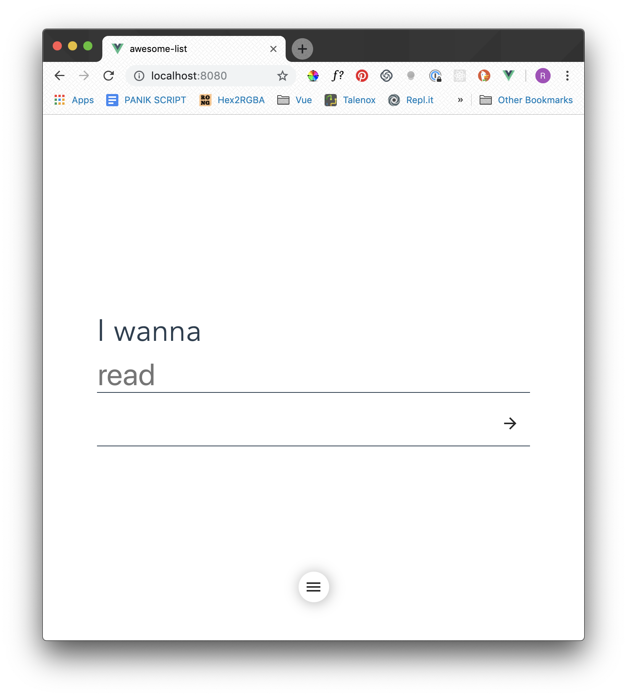
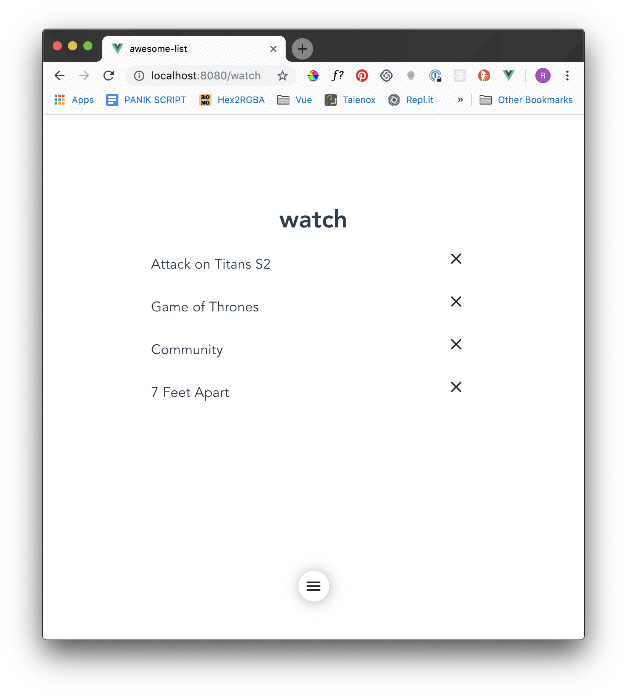

# awesome-list

A list that helps you collect your thoughts in the most minimal way possible. Ok, its just a to-do list.

What I want to do:



My to-do list:


## Infrastructure 
- VueJS frontend (built using Vue-CLI) - super shookt
- Typescript
- Firestore backend db

## Implemented
- [x] Authentication
- [x] Nav Menu
- [x] Show Lists Dynamically


## Development
```
$ npm install

// Compiles and hot-reloads for development
$ npm run serve

// Compiles and minifies for production
$ npm run build

// Run your tests
$ npm run test

// Lint files
$ npm run lint

// Fix errors
$ npm run fix
```